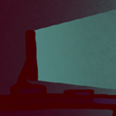
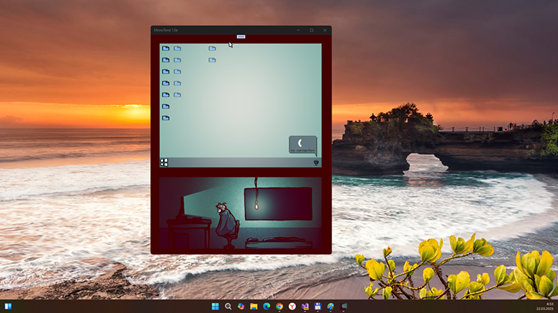
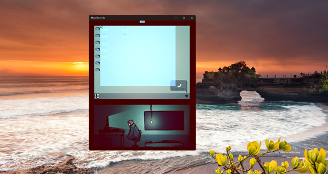

# MonoTone 1.0-prealpha - uwp branch 

"UWP-Remake" of ITCH.io MonoTone "game template" project.

## About
"What do you do when you can't afford internet or any kind of games? You'll have to entertain yourself with the click-and-drag box on your desktop. That's low budget entertainment at its finest!
Almost 5 seconds of intense gameplay!

Made for the MonoGameJam in a single day because time management is hard.
I still wanted to share it because I think the idea is funny and it's my first "game" made with MonoGame."

## Screenshots

## Tech details
- Published on ITCHO.io:	 Jun 14, 2021
- Author: RustingRobot
- Janre: Simulation
- It's only game template ("sketch") to simplify your own PC/OS-simulation game dev :)
- UWP app : Min Win. SDK is 10240, Main Win. SDK is 19041  

## Game control via Mouse
- Mouse pointer "replication" (move, Left Click)
- Righ click incorporated but not used yet :)

## ToDo
- Realize some simplest game process ;)

## .
As is. No support. DIY. Learn purposes only.

## Reference(s)
https://rustingrobot.itch.io/monotone Original project

## ..
[m][e] March 2025
